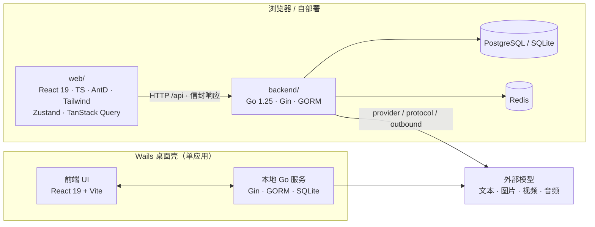

<p align="center">
  
</p>

<p align="center"><strong>High-performance · Lightweight · AI Native</strong></p>

<p align="center">
  面向 AI 时代的视频创作工作台。<br>
  在一个自由画布中连接创意、模型、素材与 Agent。
</p>

<p align="center">
  
  
  
  
  
</p>

<p align="center">
  <a href="#产品演示">产品演示</a> ·
  <a href="#技术架构">技术架构</a> ·
  <a href="#快速开始">快速开始</a> ·
  <a href="docs/content/docs/overview/features.mdx">功能清单</a> ·
  <a href="QUICKSTART.md">开始使用</a> ·
  <a href="CONTRIBUTING.md">参与贡献</a>
</p>

---

## 产品演示

https://github.com/user-attachments/assets/94fe6a39-6933-44b3-a9a9-dbc28b2d284c

[下载产品演示视频](https://github.com/glanderness/Kinotv/releases/download/v1.5.5/kinotv-demo.mp4)

## Why Kinotv

| High Performance | Lightweight | AI Native |
| --- | --- | --- |
| 面向复杂创作画布优化。视口渲染、节点加载、媒体预览与生成任务彼此解耦，让项目增长时仍能保持顺畅操作。 | 以低资源占用和低使用门槛为目标。一个桌面工作区即可开始创作，能力按需加载，不要求部署完整的生产 SaaS。 | AI 不是附加按钮，而是工作流的一部分。Agent 可以理解画布、调用模型、组织素材，并将结果写回可继续编辑的创作流程。 |

## 一个画布，完整创作链路

- **生成**：从提示词或参考素材生成文字、图片、视频与音频。
- **组织**：用节点和连线建立素材关系、创作上下文与生成流程。
- **加工**：继续裁切、标注、局部重绘、拆分、引用和组合结果。
- **迭代**：保留过程、复用素材，让一次生成变成可持续演进的工作流。

Kinotv 同时提供项目库、个人资产库、异步任务、模型渠道、创作工具与 Agent 工作区。完整范围见[功能清单](docs/content/docs/overview/features.mdx)。

## 技术架构

Kinotv 由三个边界清晰、可独立运行的单元组成。桌面端通过 Wails 把前端 UI 与本地 Go 服务打包成同一个应用；自部署时前端与后端分离运行，可叠加 PostgreSQL 与 Redis。



### 调用链

- **前端 → 后端**：业务 API 统一从 `web/src/services/api/request.ts` 的 `http` 发出，后端解包 `{ code, data, msg, reason }`；HTTP 200 不等于业务成功，`code !== 0` 即失败。
- **后端内部**：`HTTP → handler → localapp/domain port → app/domain implementation → repository/model`；需要模型上游时进入 `generation / provider / protocol / outbound`。

### 前端 `web/`

| 目录 | 职责 |
| --- | --- |
| `pages/` · `layouts/` | 路由页面、页面私有 hook/组件、路由级布局与全局浮层 |
| `components/canvas/` · `stores/canvas/` · `lib/canvas/` | 画布组件、状态与算法分离，事件边界覆盖 modal/popover/dropdown |
| `services/api/` | 业务 API、模型渠道协议、资源 API；唯一调用入口 `http` |
| `services/` | 文件、媒体、同步、缓存与生成任务等跨页面副作用 |
| `stores/` | 跨页面状态；大对象走 `localforage`（用户 scope），小配置走 `localStorage` |
| `lib/` | 纯函数、协议转换、设计 token 与可独立测试的基础能力 |

技术栈：Vite · React 19 · TypeScript · React Router · Ant Design · Tailwind · Zustand · TanStack Query。

### 后端 `backend/`

| 目录 | 职责 |
| --- | --- |
| `cmd/` | 可执行入口（`desktop`、`server`）、迁移与启动配置 |
| `internal/handler/` | HTTP 入参、本地 workspace context、调用领域端口与统一响应 |
| `internal/bootstrap/` · `localapp/` | 本地组合根与窄端口；启动层不重新暴露巨型 `app` 方法集 |
| `internal/app/` | 跨域编排；Provider、Protocol、自定义渠道与插件是必须保留的本地扩展能力 |
| `internal/task/` · `asset/` · `project/` · `generation/` | 本地领域合同与实现，不反向 import `internal/app` |
| `internal/provider/` · `protocol/` · `outbound/` | 模型供应商能力、协议实现与外部出站 |
| `internal/repository/` · `model/` · `database/` | GORM 查询持久化、结构枚举、连接与迁移 |

技术栈：Go 1.25 · Gin · GORM · SQLite（主线） / PostgreSQL（生产 Compose）。

### 文档 `docs/`

Next.js + Fumadocs + MDX，内容在 `docs/content/docs/`。专题文档（功能清单、HTTP API、代码地图、数据库、部署、安全）维护在 docs 站，根 README 只保留入口。

## 技术栈

| 层 | 选型 |
| --- | --- |
| 前端 | React 19 · TypeScript · Vite · React Router · Ant Design · Tailwind · Zustand · TanStack Query |
| 后端 | Go 1.25 · Gin · GORM · SQLite（本地）/ PostgreSQL（生产） · Redis（生产缓存） |
| 桌面 | Wails（React UI + Go 服务打包为单应用） |
| 文档 | Next.js · Fumadocs · MDX |
| 部署 | Docker Compose · Nginx |

## 快速开始

### 宿主机开发

```bash
git clone https://github.com/glanderness/Kinotv.git
cd Kinotv

# 后端（终端 1）
cd backend
CANVAS_BACKEND_DATA_DIR=../.local/project-workbench-debug go run ./cmd/server

# 前端（终端 2）
cd web
bun install
bun run dev
```

> 后端开发必须使用 Git 忽略的 `.local/project-workbench-debug` 作为数据目录，不要把 `backend/data` 当作开发账号数据库。前端统一用 Bun + Vite，不要用 pnpm/npm 覆盖同一套 `node_modules`。

### Docker 开发

```bash
docker compose -f docker-compose.dev.yml up
```

详细环境要求、Windows 构建与桌面发布方式见 [`QUICKSTART.md`](QUICKSTART.md) 和[桌面发布文档](docs/desktop-release.md)。首次启动后添加自己的模型渠道即可开始创作。

## 部署

| Compose 文件 | 用途 |
| --- | --- |
| `docker-compose.yml` | 默认编排 |
| `docker-compose.dev.yml` | 开发热更新 |
| `docker-compose.local.yml` | 本地源码构建运行 |
| `docker-compose.deploy.yml` | 生产部署（PostgreSQL、Redis、backend、web） |
| `docker-compose.build.yml` | 叠加于 deploy，源码构建镜像 |
| `docker-compose.server.yml` | 服务器编排 |

生产部署公网只暴露 web 的 `3000`，backend `8080` 留在 Compose 网络内。完整部署说明见[部署文档](docs/content/docs/deploy/).

## API 与集成

- **OpenAPI 3.0**：`GET /api/openapi.yaml`
- **统一响应信封**：`{ code, data, msg, reason }`；机器可读原因放在 `reason`
- **文本任务 SSE**：`GET /api/tasks/:id/text-events`，游标为递增事件 `id`，断线用 `Last-Event-ID` 或 `?after=`
- **自定义模型渠道**：浏览器 API Key 保存在本地，自定义渠道经后端 `/api/ai/custom` 中转，重建 headers 时清除第三方密钥，不把密钥写入 URL

详见 [HTTP API 文档](docs/content/docs/backend/http-api.mdx) 与 [代码地图](docs/content/docs/backend/code-map.mdx)。

## Open by design

- 自由配置文本、图片、视频与音频模型渠道，不绑定单一 Provider。
- 项目、画布、素材与任务由统一工作区管理，数据可以本地保存和迁移。
- 桌面端基于 React、Go 与 Wails，模型协议和工作台能力可继续扩展。

## 安全

要点摘录，完整见 [`SECURITY.md`](SECURITY.md)：

- 所有对象读/写/删在 service 校验当前用户与资源归属；管理员权限在 service 校验，不依赖前端隐藏按钮。
- 默认拒绝本机、私网与链路本地上游；可信开发主机只能通过 `CANVAS_ALLOWED_PRIVATE_UPSTREAM_HOSTS` 精确放行，不设“允许全部私网”绕过 SSRF 防护。
- 用户 API Key 保存在浏览器本地，只在可信部署和 HTTPS 下提交给自部署后端；日志、错误上报、URL、localStorage 与持久任务正文不写入敏感信息。
- 生产必须配置 `CANVAS_CORS_ORIGINS`、保持 HTTPS、限制数据目录与 `.settings-key` 权限，默认关闭公开注册。

## 项目状态

Kinotv 正在快速迭代，数据结构和外部接口仍可能变化。建议在个人设备或可信环境中使用，并避免将本地 workspace API 直接暴露到公网。

- [更新记录](CHANGELOG.md)
- [安全策略](SECURITY.md)
- [贡献指南](CONTRIBUTING.md)
- [行为准则](CODE_OF_CONDUCT.md)

## 贡献与许可

欢迎提交 Issue 和 Pull Request。开发流程与测试要求见 [`CONTRIBUTING.md`](CONTRIBUTING.md)。提交说明使用 `<type>(<scope>): <业务模块> - <变更摘要>`，`type` 为 `feat|fix|refactor|perf|docs|test|build|ci|chore|revert`。

项目按照 [`LICENSE`](LICENSE) 发布；上游来源、保留声明与第三方归属见 [`NOTICE`](NOTICE)，第三方组件许可见 [`THIRD_PARTY_NOTICES.md`](THIRD_PARTY_NOTICES.md)。
